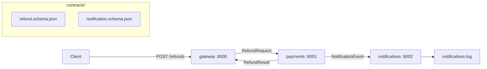

# Sample Monorepo — Python / FastAPI variant

This is the practice codebase for the Claude Code 102 labs: a small payments
monorepo with three FastAPI services that talk to each other over HTTP and
agree on shared JSON contracts. It is deliberately small — the point is not
the business logic, it is practicing multi-agent work (worktrees, subagents,
hooks, agent teams) on a repo with more than one moving part.

## Layout

```
python-fastapi/
├── init.sh                  # turns your copy into a standalone git repo
├── .env.example             # service ports + fake SMTP URL
├── .worktreeinclude         # git-ignored files copied into agent worktrees
├── .claude/
│   └── settings.json        # worktree config, deny rules, hook wiring
├── contracts/               # shared JSON Schemas (source of truth between services)
├── specs/
│   └── feature-refunds.md   # the refund feature spec used in Demo 5 / Lab 5
└── services/
    ├── gateway/             # public HTTP entry point
    ├── payments/            # payment records + refund decisions
    └── notifications/       # records customer-facing notifications
```

## How the services fit together



| Service | Role | Contract it speaks |
|---|---|---|
| `gateway` | Accepts client requests, forwards refunds to payments | `contracts/refund.schema.json` |
| `payments` | Owns payment records, decides approve/reject on refunds | `contracts/refund.schema.json` |
| `notifications` | Consumes events, appends them to `notifications.log` | `contracts/notification.schema.json` |

The schemas in `contracts/` are the source of truth. When two services
disagree about a payload, the schema wins — several labs depend on that rule.

## Getting started: copy out, then init

Do **not** run `init.sh` where it sits. This directory lives inside the course
repo, and the labs need it to be its own git repository with its own history
and branches. Copy it out first:

```bash
cp -R sample-monorepo/python-fastapi ~/labs/refund-monorepo
cd ~/labs/refund-monorepo
./init.sh
```

`init.sh` refuses to run inside the course checkout and tells you the exact
commands to copy it out.

## What init.sh does

1. `git init -b main`, copies `.env.example` to `.env`, and makes the initial
   commit — skipping any step that already happened, so re-running is safe.
2. Builds a `flat-claude-md` branch where the root `CLAUDE.md` and every
   `services/*/CLAUDE.md` are squashed into one big root file. You will use
   this branch to compare `/context` behavior against the per-service layout
   on `main`. If the `CLAUDE.md` files are not in your copy yet, the script
   warns and skips this branch instead of failing.
3. Prints your next steps: create a venv, then start `claude`.

## After init

```bash
python3 -m venv .venv
.venv/bin/python3 -m pip install -U pip
claude
```

Service dependencies and run commands live in each service's own README once
the services are implemented.
