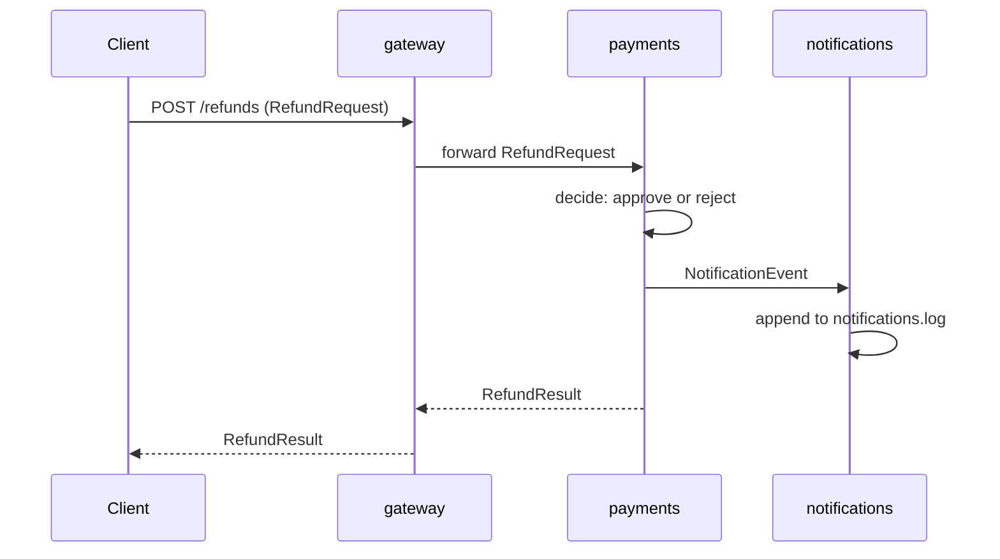

# Feature spec: Refunds

> Customers can request a refund for a completed payment.

This spec drives Demo 5 / Lab 5 (subagents implementing one feature across
three services) and, in Part 2, the Agent Teams lab. All payloads are defined
by the JSON Schemas in `contracts/` — when this document and a schema
disagree, the schema wins.

## Flow



## Gateway

Expose `POST /refunds`:

- Accepts a `RefundRequest` body (see `contracts/refund.schema.json`).
- Rejects malformed bodies with HTTP 422 before anything reaches payments.
- Forwards valid requests to the payments service
  (`http://localhost:${PAYMENTS_PORT}`) and returns the payments response
  to the client unchanged.

**Acceptance criteria**

- [ ] `POST /refunds` with a valid `RefundRequest` returns the `RefundResult`
      produced by payments, same status code and body.
- [ ] A body missing a required field returns 422 and payments is never called.
- [ ] Gateway performs no refund decision logic of its own.

## Payments

Own the refund decision:

- Look up the payment referenced by the `RefundRequest`.
- **Approve** when the payment exists, its status is `completed`, and the
  requested amount is less than or equal to the payment amount.
- **Reject** in every other case (unknown payment, not completed, amount too
  high), with a machine-readable rejection reason in the result.
- Return a `RefundResult` conforming to `contracts/refund.schema.json`.
- On every decision (approved or rejected), emit a `NotificationEvent` to the
  notifications service.

**Acceptance criteria**

- [ ] Refund of 50 against a completed payment of 100 is approved.
- [ ] Refund of 150 against a completed payment of 100 is rejected.
- [ ] Refund against a pending or unknown payment is rejected.
- [ ] Every decision produces exactly one `NotificationEvent`.

## Notifications

Record customer-facing notifications:

- Consume `NotificationEvent` payloads conforming to
  `contracts/notification.schema.json`.
- Append each accepted event as one line to `notifications.log`.
- Reject events that do not validate against the schema; nothing is logged
  for a rejected event.

**Acceptance criteria**

- [ ] A valid event results in exactly one new line in `notifications.log`.
- [ ] An invalid event is rejected and `notifications.log` is untouched.

## Running checks (this variant)

```bash
.venv/bin/python3 -m pytest services/          # all service tests
.venv/bin/python3 -m pytest services/payments  # one service
```

---

## Part 2 — teams lab only

**Do not implement this in Lab 5.** This extension is reserved for the Agent
Teams lab, where one teammate owns the contract change and the others adapt
their services to it.

Add a required `reason` field to `NotificationEvent`:

- `contracts/notification.schema.json` gains a required string field `reason`
  (why the customer is being notified, e.g. `refund_approved`,
  `refund_rejected_amount_exceeds_payment`).
- Payments must populate `reason` on every event it emits.
- Notifications must reject events without `reason` and include it in the
  logged line.

**Acceptance criteria (Part 2)**

- [ ] The schema change, the payments change, and the notifications change
      land as a coherent set — at no point does one service emit or accept a
      payload another service cannot handle.
- [ ] All Part 1 acceptance criteria still pass.
